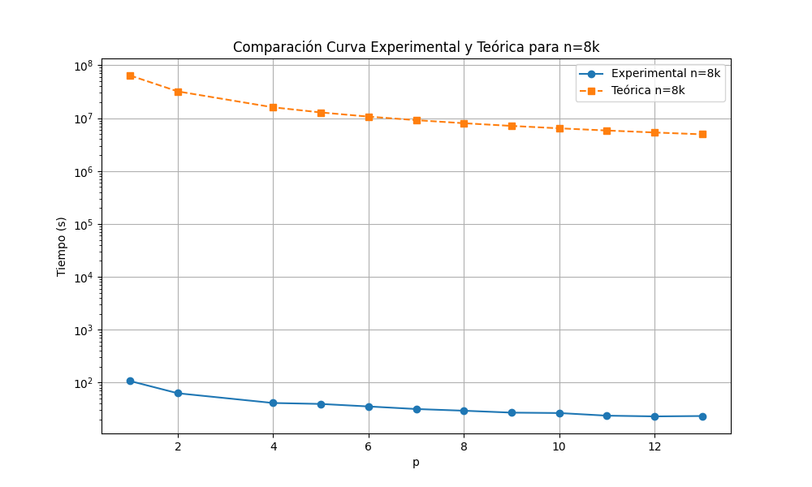
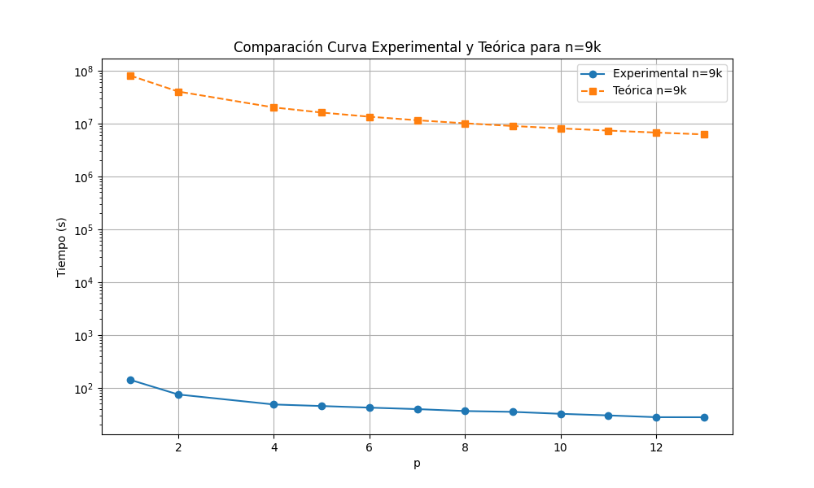
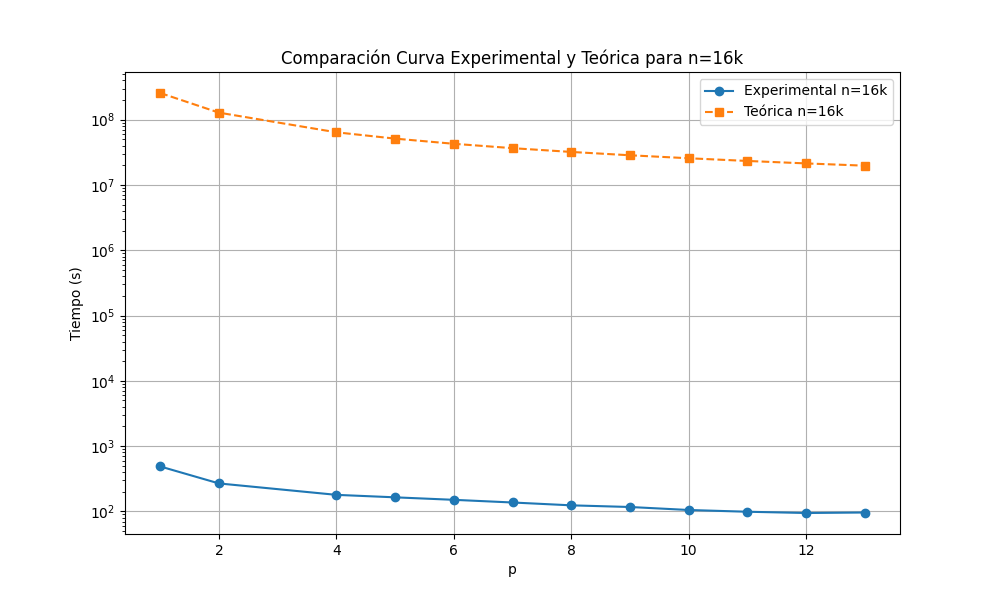

# proyecto-paralela

## Compilación y ejecución
Como indica en el enunciado, en este proyecto trabajaremos sin gpu. Para ello, el código proporcionado se utilizará del siguiente modo:
- Compilar: make cpu-4th
- Ejecutar: mpirun -np=<num_procesos> ./cpu-4th

Para cambiar el tamaño del problema, se debe de ejecutar el siguiente comando: 
./gen-plum.exe <n> <np>

, de tal manera que el tamaño del problema sera N = n*np(kb/np), donde kb=1024.

## Item 1: PRAM y complejidad teórica

### PRAM
El PRAM lo puede encontrar en PRAM/PRAM.cpp. En éste comentamos la compleijidad de cada operación a detalle.

### Complejidad teórica

OJO: a pesar de que el código contenga directiva pragma omp, el código no es híbrido (solo tiene MPI).

Utilizando el PRAM realizado, la complejidad teórica a la que llegamos es 
T_p(n,p) = O(n) + O(p*(alpha+beta)) + O(p*(alpha+n*beta)) +   O(n/p) + O(n) + O(n^2/p) + O(log(p)*(alpha+n*beta)) + O(n) + O(n) + #_intervalos_tiempo*( O(n) + O(n) + O(n^2/p) + O(log(p)*(alpha+n*beta)) + O(n) + O(n) )

= O(p*(alpha+n*beta)) + + O(n^2/p) + #_intervalos_tiempo( O(n^2/p) + O(log(p)*(alpha+n*beta))) 

## Medición de tiempo y comparación con curva teórica
OJO: el programa calcula el tiempo total del algoritmo dentro del while principal, es decir, debemos usar la curva teórica que considera solamente lo que está dentro de dicho bucle para la comparación:
T_p = #_intervalos_tiempo( O(n^2/p) + O(log(p)*(alpha+n*beta))) 
 = O(n^2/p) + O(log(p)*(alpha+n*beta)) = O(n^2/p) + O(logp+nlogp) = O(n^2/p) + O(nlogp) = O(n^2/p + nlogp)

