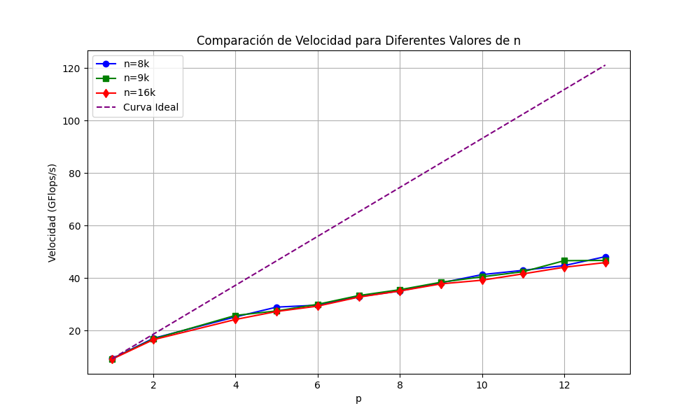
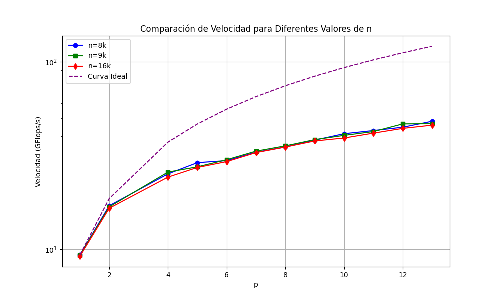

# proyecto-paralela

## Compilación y ejecución
Como indica en el enunciado, en este proyecto trabajaremos sin gpu. Para ello, el código proporcionado se utilizará del siguiente modo:
- Compilar: `make cpu-4th`
- Ejecutar: `mpirun -np=<num_procesos> ./cpu-4th`

Para cambiar el tamaño del problema, se debe de ejecutar el siguiente comando: 
`./gen-plum.exe <n> <np>`

, de tal manera que el tamaño del problema sera $N = n(np)\left(\frac{kb}{np}\right)$, donde $kb=1024$.

## Item A: PRAM y complejidad teórica

### PRAM
El PRAM lo puede encontrar en ItemA/PRAM.cpp. En éste comentamos la compleijidad de cada operación a detalle.

### Complejidad teórica

OJO: a pesar de que el código contenga directiva pragma omp, el código no es híbrido (solo tiene MPI).

Utilizando el PRAM realizado, la complejidad teórica a la que llegamos es 

$$ T_{p}(n,p) = O\left(\frac{n}{p}\right) + O(n) + O\left(\frac{n^2}{p}\right) + O\left
((\alpha+n\beta)\log p\right) + O(n) = O\left(\frac{n^2}{p}\right) + O(n\log p) $$

### Condición de escalabilidad

Apartir del $T_p$ obtenemos expresiones algebraicas para el speedup (S) y eficiencia (E).

$$S = \frac{T_s}{T_p}=\frac{n^2}{\frac{n^2}{p}+n\log p}=\frac{1}{\frac{1}{p}+\frac{\log p}{n}}$$

$$E=\frac{S}{p}=\frac{1}{1+\frac{p\log p}{n}}$$

La ultima expresión nos brinda información sobre cuan eficiente es el algoritmo para distintos tamaños de problema n y número de procesadores p. Observamos que, si mantenemos fijo n y aumentamos p, la eficiencia podría degradarse considerablemente. Por tanto, para que el algoritmo sea escalable, es decir $E=O(1),$ se debe cumplir que $n \propto p \log p$.

## Item B: Medición de tiempo y comparación con curva teórica

 Realizamos la medición de tiempos y anotamos los resultados en el achivo ItemB/experimentacion.xlsx. Luego, graficamos las curvas en ItemB/graficos.py. Al finalizar, obtuvimos los siguientes resultados:

Se valida la relación entre las curvas teórica y experimental obtenidas, pues se observa que una siempre es proporcional a otra. Para suporponer la curva teórica sobre la experimental lo más posible utilizamos mínimos cuadrados para hallar la constante de proporcionalidad y obtuvimos los siguientes resultados:

Note que aún existe una ligera diferencia entre las curvas teóricas y experimentales. Esto puede deberse a que en la complejidad teórica no consideramos varios bucles lineales presentes en el código original, lo que provoca que la curva teórica disminuya más rápidamente con p que la experimental.

## Item C: Medición de velocidad para distintos valores de n y p

Se utilizó el cálculo de la velocidad en Flops/s que ya estaba implementada en el código (se calcula como la división del número de flops entre el tiempo de ejecución total del algoritmo) para medir las curvas de velocidad para distintos números de procesos dado un tamaño del problema n.

Además, en cada gráfica se incluye la curva de velocidad ideal, que se calcula como la velocidad para un n cualquiera y p=1 multiplicada por el número de procesos utilizados. Esto asegura que estemos asumiendo que la velocidad escala directamente proporcional a p y se genere una recta.

- Sin escala logarítmica:

- Con escala logarítimica:

### Análisis de escalabilidad
A partir de las gráficas obtenidas, se puede afirmar que para valores de n menores a 16k y valores de p menores a 13, n crece con p, pero no idealmente. Esto, en su mayoría, es producto de la comunicación entre procesos para realizar operaciones como el Allreduce, que es el que aporta el término más grande de comunicación en el algoritmo.

Es muy probable que si aumentáramos el tamaño del problema o el número de procesos podríamos evidenciar una mejor escalabilidad (Spurzem et al., n.d.), pero el hardware utilizado nos limita a los valores empleados.

## Item D: Software de análisis de performance

El programa brindara métricas de performance en base tiempos de ejecución para distintos valores de n y p. Concluye con si el algoritmo es escalable o no.

Métricas de performance
- Speedup / Velocidad (S = Ts / Tp)
- Eficiencia (E = S / p)
- Conclusiones sobre escalabilidad (E = 1 o S = O(p))

(3D chart n vs p vs tiempo)

## Bibliografía

- Spurzem, R., Berczik, P., Hamada, T., Nitadori, K., Marcus, G., Kugel, A., M ̈anner, R., Berentzen, I., Fiestas, J., Klessen, R., & Banerjee, R. (n.d.). Astrophysical Particle Simulations with Large Custom GPU Clusters on Three Continents.
